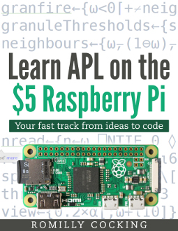

(appendix-a) =
# Appendix A - Exploring Dyalog APL

## Getting Dyalog APL

Dyalog APL is free for non-commercial use. It runs on Windows, Linux and OS/X.

You can [download it here](https://www.dyalog.com/download-zone.htm).

There is also a [32 bit version available for the Raspberry Pi](https://www.dyalog.com/dyalog/raspberry-pi.htm).

## Version information

The book was written using Dyalog 64-bit APL R 18.0 for Linux.

Dyalog have always had an excellent track record of maintaining forward compatibility, so I expect the code to work unchanged in future releases.

## Running the notebooks

I suggest that you follow [this advice](https://rojergs.github.io/MDAPL/README.html)
which was written for Dyalog's free on-line version of **Mastering Dyalog APL**.
It will tell you how to install the Jupyter software that you need to run notebooks, and how to install the Dyalog APL kernel for Jupyter which enables you to run notebooks that use APL.

The notebooks used in this book are in [this MENACE repository](https://github.com/romilly/o-x-o) on GitHub.

## APL Quickstart

There are some great free resources listed on Dyalog's [TryAPL](https://tryapl.org/) website.

## Books

There are two books that you may want to look at.

### Mastering Dyalog APL

The book is currently available in two versions.

1. The original book is somewhat out of date, but you can find out how to get it [here](https://www.dyalog.com/mastering-dyalog-apl.htm) in print or as a free pdf.
1. An updated but incomplete version is [currently available online](https://rojergs.github.io/MDAPL/README.html). It's a work in progress and its location may move.

### Learn APL on the $5 Raspberry Pi

*Disclosure*: I wrote it, it's currently incomplete, and it also needs updating.

However, you can get it [free on LeanPub](https://leanpub.com/learnapl).
You will need to reduce the price from the recommended 5$ using the price slider on the web page.

The current contents will help you to understand much of the code in this book.

